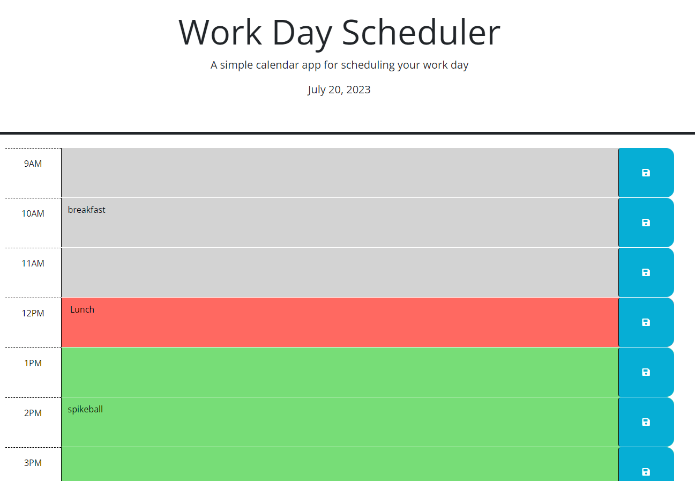

# Work-Day-Scheduler

## Description

The purpose of this project is to allow the user to schedule out their day. The website allows the user to type in activities, tasks, etc. that they want to do at certain times
during the day from the hours of 9 am to 5 pm. I personally wanted to create this to help people stay more organized and make better use of their time.

## Installation

N/A

## Usage

To operate the scheduler, you start by clicking into a text box that correlates with the time you want to start a task.
Future times are represented with a green background, the present time is represented with a red background, and past times are represented with a gray background.
After typing in whatever you want, click the blue save button to the right of the textbox you wrote in to save the task to local storage allowing it to say even when the page is refreshed.
To remove an item, click the save button with the text box empty.

## License

Refer to LICENCE in repo.
